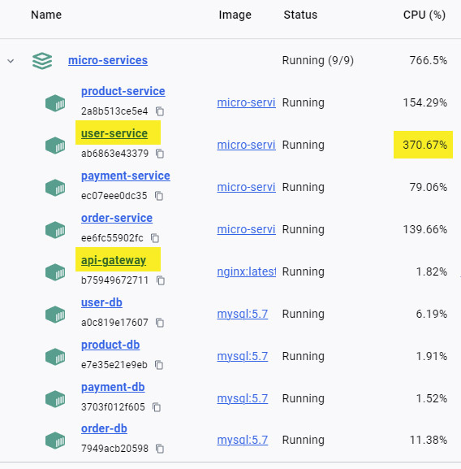

# Stress test for Micro Services

I am using [Hyperfoil.io](https://hyperfoil.io/) to generate some 
load for the micro-services API [here](https://github.com/iliepandia/micro-services-ecommerce). 

## Stress-Load Configuration file

This is the configuration file I am using the for load.

[micro-load1.hf.yaml](hyperfoil-0.27.1/examples/micro-load1.hf.yaml)

It simulates some general un-authenticated requests and...

on top of that it simulates a user flow:
- login
- browse the product list
- place an order 
- make a payment
- each request has a small delay after it to simulate a real user
  looking at the page.

## Next steps

Make the micro-services app a distributed app. The initial test the app 
runs on the local machine, with docker compose. 

Scale services up and down see how the stress response is affected.

## Challenges

1. I've run in many situations where the Virtual User would hamg
   in Hyperfoil.io, and the solution was to for a maximum session time
   after which the session will be terminated, regardless of where the 
   user is in their flow. 

2. I don't ge to put much stress on the `payment-service`, because 
   the `user-service` and `product-service` start to fail before we 
   get to that part. This is where having the app deployed on multiple
   nodes will come in handy because I will be able to scale up the 
   user and product service.

3. User-Service is the most stressed because all other services need 
   to check the auth token against that service, make sure the token is
   valid.